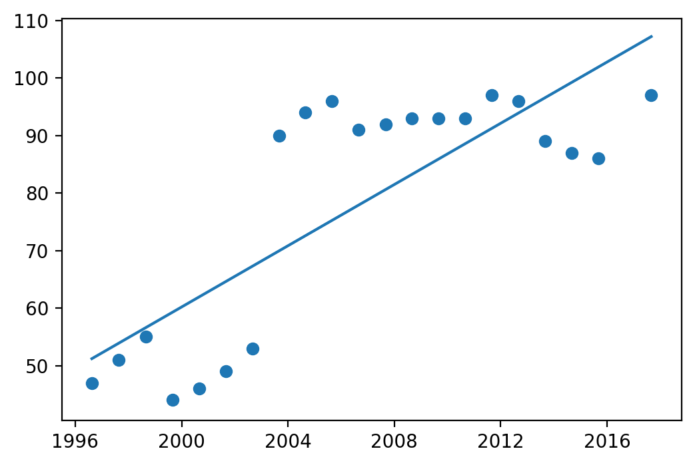

# Import statements


```python
import pandas as pd
import matplotlib.pyplot as plt
from scipy import stats
import numpy as np
```

# Main script
The script contains of 5 main steps:

1. Import data and clear NoData values
2. Define a function to extract one row for each year that is closest to a chosen date (currently 15 August)
3. Define a regression function that returns the slope (unit/year) and r-value (correlation coefficient) of the previous function's output
4. Apply that function to every single grid node (every point)
5. Save the result

Note that the input data has to contain the exact (case-sensitive) columns: "Date, Grid_node, Northing, Easting, Value". The date column has to be the first one in the dataset. 


```python
# Read input data
input_path = "input.csv"
output_path = "ouput.csv"

data = pd.read_csv(input_path, index_col=0, parse_dates=True, dtype=np.float64)

data = data[data["Value"] != -9999]  # Remove NoData values

def monthly_vals(df, month=8, day=31):
    """
    Returns the closest row to a certain date, e.g. 31 August.
    """
    month_vals = pd.DataFrame(columns=list(df.columns) + ["diff"])  # Initiate dataframe    
    
    for year, yearly in df.groupby(df.index.year):
        df2 = yearly.copy()  # Ugly necessity
        
        # New column showing difference in days between set date
        df2["diff"] = abs(df2.index - pd.datetime(year=year, month=month, day=day))

        closest = df2.sort_values("diff").iloc[0]  # Take closest value

        month_vals.loc[closest.name] = closest  # Put this in month_vals dataframe
    
    return month_vals

def regression(node, reg_series=False):
    """
    Returns the change in units/year and r-value of linear regression with input values and date index.
    If reg_series is True, it returns a series for plotting.
    """
    # Get one-month-per-year values
    monthly = monthly_vals(node)
    
    # Days instead of date is needed for regression analysis
    monthly["days"] = monthly.index.to_julian_date()
    
    # Linear regression between passed days (since 1 January, 4713 BC) and point value
    slope, intercept, r_value, p_value, std_err = stats.linregress(monthly["days"], monthly["Value"])
    
    if reg_series:  # Returns regression series, for plotting purposes
        return pd.Series(index=monthly.index, data=(monthly["days"] * slope + intercept))
    
    else:
        # Return change in unit per year, and absolute r-value
        return slope * 365, abs(r_value)

def apply_regression(df):
    """
    Apply the regression function to every node in the dataset.
    """
    # Output preparation (one row for each unique Grid_node value)
    output = pd.DataFrame(index=np.unique(data["Grid_node"]), columns=["Easting", "Northing", "unit_per_year", "r_value"], dtype=np.float64)
    
    # Iterate over each grid node
    for node_nr, node in df.groupby("Grid_node"):
        cm_per_year, r_value = regression(node)  # Run regression function
        easting, northing = node.iloc[0][["Easting", "Northing"]]  # Take first occurring values (they should all be same)

        output.loc[node_nr] = [easting, northing, cm_per_year, r_value]  # Put that as row with the node number as index
        
    
    output.index.name = "Grid_node"
    return output

# Run the functions and save the result
change_per_year = apply_regression(data)
change_per_year.to_csv(output_path)

print(change_per_year.head())

node = data[data["Grid_node"]==40]
aug = monthly_vals(node)
series = regression(node, reg_series=True)

plt.figure(dpi=200)
plt.plot(series)
plt.scatter(aug.index, aug["Value"])
```

                 Easting    Northing  unit_per_year   r_value
    Grid_node                                                
    1.0        513362.26  8264855.08       0.807511  0.704822
    2.0        513372.76  8264854.16       0.970558  0.771310
    3.0        513382.50  8264852.96       0.532696  0.542589
    4.0        513392.05  8264852.55       1.403432  0.865454
    5.0        513401.14  8264851.40       1.336502  0.844795
    


    <matplotlib.collections.PathCollection at 0x153686ef358>




